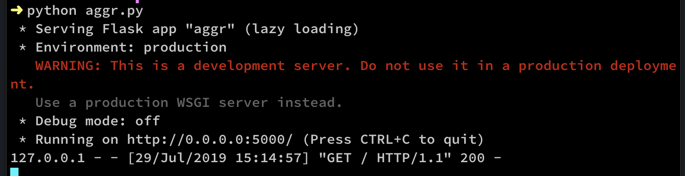
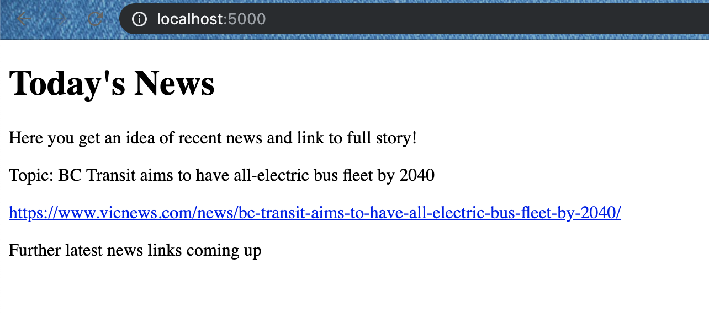

### Basic idea of this repo: 

This repo includes a python based application code, which can scrape news from specified websites and display it in a aggregated way.

This was mainly initiated since we plan to use this in our home automation system wherein we would like to view the relevant news highlights from multiple sites on a home tab.

---

### Python modules used:

>-  Flask to serve a webpage
>-  requests to access the specified website and get the page contents
>-  BeautifulSoup using which we can scrape desired content from the available data.

---

### How to run?

To run the app, you simply execute the .py file as: `python aggr.py`

The app by default starts listening on port 5000. You should see below results in running the py file:

The served webpage looks like below (You can edit templates/page.html page to edit the looks of your served page):

Note: This code involves scraping for a specific news website. Based on the website of your choice, you might need to employ slightly different logic and bs4 attributes in order to scrape desired content.

---

### Further plans:
This repo is still in progress as I plan to add following:

1) Few more websites to scrape the news update from.
2) A logic to automatically check for updates/change in news.
3) Store past few updates for the day that can be accessed.